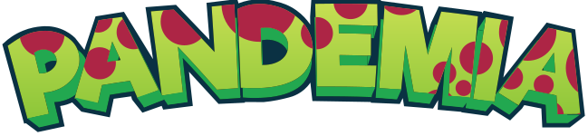

<p align="center">
  
</p>

<p align="center">
     
</p>

<br>

## 🧪 Tecnologias

Esse projeto foi desenvolvido com as seguintes tecnologias:

- [Unity](https://unity.com/pt)
- [C#](https://docs.microsoft.com/pt-br/dotnet/csharp/)

## 🚀 Como executar

Clone o projeto e acesse a pasta do mesmo.

```bash
$ git clone https://github.com/alexsantosdev/pandemia.git
$ cd pandemia
```

## 💻 Projeto

Pandemia aborda temas muito presentes no dia a dia, tanto nas áreas do entretenimento, como na saúde, por exemplo. A Gameplay tem como motivação relembrar os jogadores de jogos que fizeram parte de sua infância.

Este é um projeto desenvolvido durante o Trabalho de Conclusão de Curso (TCC), para o Curso de Ciência da Computação.


## 🔖 Layout

Você pode visualizar o layout do projeto através do link abaixo:

- [Layout Web](https://www.###) 

## 📝 License

Esse projeto está sob a licença MIT. Veja o arquivo [LICENSE](LICENSE.md) para mais detalhes.

---

Feito com 💜 by Alex Sandro.